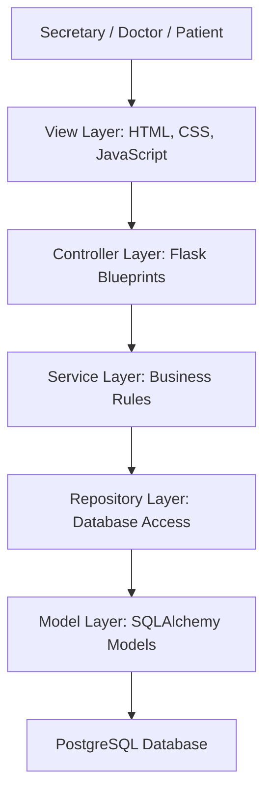

# Architecture Overview

The system follows a layered architecture with an MVC-style web structure.

## Layer Responsibilities

| Layer | Responsibility |
|---|---|
| View | Presents role-specific panels and forms. |
| Controller | Receives requests, chooses templates, and calls services. |
| Service | Handles appointment conflicts, availability rules, and patient flow transitions. |
| Repository | Centralizes database reads and writes. |
| Model | Defines persistent clinic entities and relationships. |

## Extensibility Notes

Future modules such as prescriptions, medical records, lab results, and billing should be added as separate controllers and services. Existing panels already reserve interface entry points for these modules, so navigation does not need to be redesigned later.
